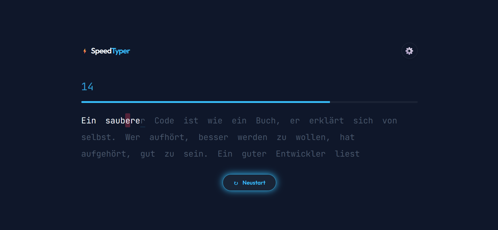

# ⚡ SpeedTyper

Eine moderne, ablenkungsfreie Web-Applikation zum Trainieren und Analysieren der Tippgeschwindigkeit (WPM). Entwickelt mit einem starken Fokus auf Clean UI, Performance und User Experience.

<p align="center">
  
  
</p>

## ✨ Features

- **Minimalistisches Design & Zen-Modus:** UI-Elemente blenden beim Tippen aus für maximalen Fokus.
- **Dynamic Themes:** Wähle zwischen Cyber, Light, Neon und Matrix.
- **Multi-Language & Code-Mode:** Trainiere mit echten Sätzen auf Deutsch, Englisch, Spanisch oder nutze reale Code-Snippets zum Abtippen.
- **Progressive Web App (PWA):** Installierbar und offline nutzbar dank Service Worker.
- **Lokale Historie & Statistiken:** Speichert vergangene Runden lokal und generiert am Ende jeder Session ein WPM-Verlaufsdiagramm.
- **Customizable Experience:** Einstellbare Caret-Styles (Linie, Block), Hard-Mode (Satzzeichen & Groß-/Kleinschreibung) und optionales Audio-Feedback via Web Audio API.

## 🚀 Live Demo

Probiere es direkt im Browser aus: https://github.com/IM23a-karimik/speed-typer.git

## 🛠️ Tech Stack

- **Frontend:** HTML5, CSS3 (CSS Variables, Flexbox/Grid), Vanilla JavaScript (ES6+ Module)
- **CI/CD & Qualitätssicherung:** GitHub Actions, ESLint, Prettier, SonarQube (0 Bugs, 0 Vulnerabilities)
- **APIs:** Web Audio API (Synthesizer für Tasten-Sounds), LocalStorage API

## 💻 Lokale Installation

1. Repository klonen:
    ```bash
    git clone [https://github.com/IM23a-karimik/speed-typer.git](https://github.com/IM23a-karimik/speed-typer.git)
    ```
